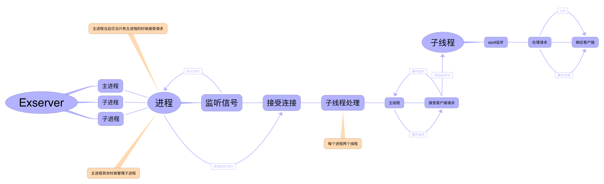

## Exserver ###

### Exserver系统架构 ###




## 静态网页Exserver服务器 ##

#### 配置文件  ####

配置文件采用  **Exjson** 格式编写，必须包含 **server** 节点

```json
{
  "server": [
    {
      "webroot": "/website/test",  // 配置网站一的根目录:/website/test
      "listen" : 8181,             // www.money.com监听8181
      "host"   : "wwww.money.com"  // 监听的host
    },
    {
      "webroot": "/website/novel", // 网站二的根目录:/website/novel
      "listen" : 8182,             // www.novel.com监听8182
      "host"   : "www.novel.com"   
    },
    {
      "webroot": "/website/data",  // 网站三的根目录:/website/data
      "listen" : 8183,             // www.data.com监听8183 
      "host"   : "www.data.com"
    }
  ]
}
```

### 运行步骤 ###

```shell
cd build
cmake ..
make
./sockets
```

网页文件采用 **sendfile** 传输，目前暂未实现图片文件等，仅实现了 **text/html** 文本文件，正在完善特性中

## 静态网页压测 ##

```shell
josin@MacBookPro-Josin:~$ ab -n10000 -c100 http://www.money.com:8181/index.html
This is ApacheBench, Version 2.3 <$Revision: 1826891 $>
Copyright 1996 Adam Twiss, Zeus Technology Ltd, http://www.zeustech.net/
Licensed to The Apache Software Foundation, http://www.apache.org/

Benchmarking www.money.com (be patient)
Completed 1000 requests
Completed 2000 requests
Completed 3000 requests
Completed 4000 requests
Completed 5000 requests
Completed 6000 requests
Completed 7000 requests
Completed 8000 requests
Completed 9000 requests
Completed 10000 requests
Finished 10000 requests


Server Software:        Exserver/1.0
Server Hostname:        www.money.com
Server Port:            8181

Document Path:          /index.html
Document Length:        50 bytes

Concurrency Level:      100
Time taken for tests:   0.337 seconds
Complete requests:      10000
Failed requests:        0
Total transferred:      1350000 bytes
HTML transferred:       500000 bytes
Requests per second:    29708.06 [#/sec] (mean)
Time per request:       3.366 [ms] (mean)
Time per request:       0.034 [ms] (mean, across all concurrent requests)
Transfer rate:          3916.59 [Kbytes/sec] received

Connection Times (ms)
              min  mean[+/-sd] median   max
Connect:        0    1   0.4      1       2
Processing:     1    2   0.7      2       6
Waiting:        0    1   0.7      1       6
Total:          1    3   0.6      3       7

Percentage of the requests served within a certain time (ms)
  50%      3
  66%      3
  75%      4
  80%      4
  90%      4
  95%      5
  98%      5
  99%      6
 100%      7 (longest request)
```

目前未实现缓存机制，相比nginx而言，性能稍微差点，后续增加缓存机制后，再对比测试，nginx测试如下：

```shell
josin@MacBookPro-Josin:~$ ab -n10000 -c100 http://www.money.com/index.html
This is ApacheBench, Version 2.3 <$Revision: 1826891 $>
Copyright 1996 Adam Twiss, Zeus Technology Ltd, http://www.zeustech.net/
Licensed to The Apache Software Foundation, http://www.apache.org/

Benchmarking www.money.com (be patient)
Completed 1000 requests
Completed 2000 requests
Completed 3000 requests
Completed 4000 requests
Completed 5000 requests
Completed 6000 requests
Completed 7000 requests
Completed 8000 requests
Completed 9000 requests
Completed 10000 requests
Finished 10000 requests


Server Software:        nginx/1.13.12
Server Hostname:        www.money.com
Server Port:            80

Document Path:          /index.html
Document Length:        170 bytes

Concurrency Level:      100
Time taken for tests:   0.330 seconds
Complete requests:      10000
Failed requests:        0
Non-2xx responses:      10000
Total transferred:      3210000 bytes
HTML transferred:       1700000 bytes
Requests per second:    30275.60 [#/sec] (mean)
Time per request:       3.303 [ms] (mean)
Time per request:       0.033 [ms] (mean, across all concurrent requests)
Transfer rate:          9490.69 [Kbytes/sec] received

Connection Times (ms)
              min  mean[+/-sd] median   max
Connect:        0    1   0.3      1       2
Processing:     1    2   0.6      2      10
Waiting:        0    1   0.6      1       6
Total:          2    3   0.5      3      11

Percentage of the requests served within a certain time (ms)
  50%      3
  66%      3
  75%      3
  80%      3
  90%      4
  95%      4
  98%      4
  99%      5
 100%     11 (longest request)
```


## 压测的源码

```c
#include "kernel/net/http_socket.h"
#include "kernel/exlist.h"
#include "kernel/types.h"
#include "kernel/net/socket.h"

void server_callback(int fd, EXLIST *header, char *request_method, char *request_url, int keep_alive)
{
	char *response;
	if ( keep_alive )
		response = generate_response_string(200, "OK", "World", 3, "Content-Type: text/html", "Content-Length: 5", "Connection: keep-alive");
	else
		response = generate_response_string(200, "OK", "hello", 3, "Content-Type: text/html", "Content-Length: 5", "Connection: close");
	write(fd, response, strlen(response));
	free(response);
}

int main(int argc, char *argv[])
{
	int server_fd;

	server_fd = http_server_init("0.0.0.0", 8181, 1000);
	generate_worker(3, server_callback);
	master_process(server_fd);
	
	return 0;
}
```

## Apache ab 命令压测

连接keep-alive情况下，由于Apache ab命令默认情况下是使用HTTP/1.0协议，因此默认情况下，每次请求都进行关闭，如果需要使用连接复用，需要添加 -k参数

### 压测的环境与开启的进程数量

**OS**: Linux MacBookPro-Josin 4.15.0-29debian-generic #31 SMP Fri Jul 27 07:12:08 UTC 2018 x86_64 GNU/Linux

进程开启 **3** 个，外加 **1** 个主进程：

```bash
josin@MacBookPro-Josin:~/Desktop/sockets/build$ ps aux | grep sockets
josin    23779  0.0  0.0   4172   672 pts/0    S+   08:51   0:00 ./sockets
josin    23780  0.5  0.0   4304    76 pts/0    S+   08:51   0:02 ./sockets
josin    23781  0.5  0.0   4304    76 pts/0    S+   08:51   0:02 ./sockets
josin    23782  0.5  0.0   4304    76 pts/0    S+   08:51   0:02 ./sockets
```

### 连接复用 -k 压测结果

```bash
josin@MacBookPro-Josin:~$ ab -k -n1000000 -c1000 http://localhost:8181/
This is ApacheBench, Version 2.3 <$Revision: 1826891 $>
Copyright 1996 Adam Twiss, Zeus Technology Ltd, http://www.zeustech.net/
Licensed to The Apache Software Foundation, http://www.apache.org/

Benchmarking localhost (be patient)
Completed 100000 requests
Completed 200000 requests
Completed 300000 requests
Completed 400000 requests
Completed 500000 requests
Completed 600000 requests
Completed 700000 requests
Completed 800000 requests
Completed 900000 requests
Completed 1000000 requests
Finished 1000000 requests


Server Software:        
Server Hostname:        localhost
Server Port:            8181

Document Path:          /
Document Length:        5 bytes

Concurrency Level:      1000
Time taken for tests:   7.169 seconds
Complete requests:      1000000
Failed requests:        0
Keep-Alive requests:    1000000
Total transferred:      92000000 bytes
HTML transferred:       5000000 bytes
Requests per second:    139493.11 [#/sec] (mean)
Time per request:       7.169 [ms] (mean)
Time per request:       0.007 [ms] (mean, across all concurrent requests)
Transfer rate:          12532.58 [Kbytes/sec] received

Connection Times (ms)
              min  mean[+/-sd] median   max
Connect:        0    0   0.4      0      18
Processing:     2    7   0.7      7      18
Waiting:        0    7   0.7      7      18
Total:          2    7   0.8      7      27

Percentage of the requests served within a certain time (ms)
  50%      7
  66%      7
  75%      7
  80%      7
  90%      7
  95%      7
  98%      9
  99%      9
 100%     27 (longest request)
```

连接复用的情况下，系统的性能呈现极佳的表现，能达到每秒 13.9w 的处理能力


### 连接不复用的压测

```bash
josin@MacBookPro-Josin:~$ ab -n1000000 -c1000 http://localhost:8181/
This is ApacheBench, Version 2.3 <$Revision: 1826891 $>
Copyright 1996 Adam Twiss, Zeus Technology Ltd, http://www.zeustech.net/
Licensed to The Apache Software Foundation, http://www.apache.org/

Benchmarking localhost (be patient)
Completed 100000 requests
Completed 200000 requests
Completed 300000 requests
Completed 400000 requests
Completed 500000 requests
Completed 600000 requests
Completed 700000 requests
Completed 800000 requests
Completed 900000 requests
Completed 1000000 requests
Finished 1000000 requests


Server Software:        
Server Hostname:        localhost
Server Port:            8181

Document Path:          /
Document Length:        5 bytes

Concurrency Level:      1000
Time taken for tests:   41.183 seconds
Complete requests:      1000000
Failed requests:        0
Total transferred:      87000000 bytes
HTML transferred:       5000000 bytes
Requests per second:    24281.86 [#/sec] (mean)
Time per request:       41.183 [ms] (mean)
Time per request:       0.041 [ms] (mean, across all concurrent requests)
Transfer rate:          2063.01 [Kbytes/sec] received

Connection Times (ms)
              min  mean[+/-sd] median   max
Connect:        0   19  24.1     18    1056
Processing:     2   22   5.7     22      82
Waiting:        1   16   5.8     15      79
Total:          4   41  24.3     40    1081

Percentage of the requests served within a certain time (ms)
  50%     40
  66%     42
  75%     43
  80%     43
  90%     45
  95%     48
  98%     52
  99%     56
 100%   1081 (longest request)	
```

不复用连接的情况下，由于增加了多个进程的调度与每个进程的epoll开销，因此性能降低很多，只能达到每秒 2.4w的处理能力

目前暂未添加 **CGI** ，服务器的配置等，感兴趣的可以参与


